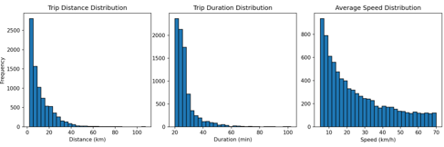
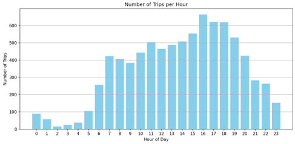
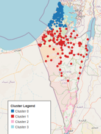
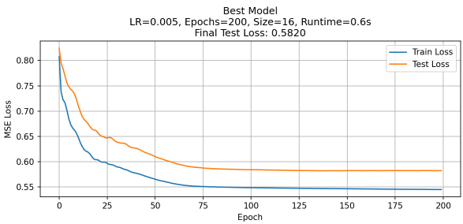

# Mobility Analysis & Machine Learning

A spatial mobility-analysis and machine-learning project developed as a final project in a Technion machine-learning course.

The project builds a complete workflow for transforming sequential cellular-location observations into detected trips, identifying spatial mobility zones, analyzing travel patterns, and predicting trip duration with a neural network.

## Project workflow

```text
Raw cellular-location observations
        ↓
Data enrichment
(distance, duration, speed)
        ↓
Trip detection and filtering
        ↓
Spatial clustering with K-Means
        ↓
Mobility-pattern analysis
        ↓
Trip-duration prediction with an ANN
```

## What is included

### 1. Data enrichment — `src/add_fields.py`
Calculates aerial distance between consecutive observations using the Haversine formula, together with elapsed time and estimated travel speed.

### 2. Trip detection — `src/create_trips.py`
Processes chronologically ordered observations for each device/sensor and identifies candidate trips using temporal, distance, and speed constraints. The resulting trip table includes origin and destination coordinates, duration, distance, average speed, departure hour, and time-of-day bin.

### 3. Spatial clustering — `src/clusters.py`
Uses K-Means to group trip origins and destinations into spatial mobility zones. The script evaluates candidate values of *k* using the elbow method and creates an interactive Folium map of the resulting clusters.

### 4. Mobility analysis — `src/analyze_trips.py`
Explores trip-distance, duration, speed, and hourly patterns. It also compares clusters using trip density, intra- vs. inter-cluster movement, maximum daily trip distance, and average travel speed.

### 5. Neural-network prediction — `src/ann.py`
Uses PyTorch to predict trip duration from:
- time-of-day bin
- origin cluster
- destination cluster
- trip distance

Categorical features are one-hot encoded and the target is standardized. Multiple learning rates, hidden-layer sizes, and training durations are evaluated, with MAE and RMSE used to compare model performance.

## Results

The extracted trips showed clear temporal and spatial structure. Trip activity increased from the morning and reached its strongest peak during the late afternoon (approximately 16:00–18:00). Distance, duration, and speed distributions were right-skewed, with most detected trips concentrated at shorter distances and durations.

K-Means clustering separated trip endpoints into **four spatial mobility regions**, revealing different urban, peripheral, and long-distance travel patterns.

For trip-duration prediction, the best ANN configuration used:

| Parameter | Best configuration |
| --- | ---: |
| Learning rate | 0.005 |
| Hidden-layer size | 16 |
| Training epochs | 200 |
| Final test loss | 0.582 |
| MAE | ~4.1 min |

The hyperparameter experiments showed that small-to-moderate networks and learning rates around 0.005–0.01 generally provided the most stable results when sufficient training epochs were used.

## Visualizations

### Trip characteristics

Most detected trips are concentrated at shorter distances and durations, with right-skewed distributions for distance, duration, and average speed.



### Hourly mobility pattern

Trip activity rises from the morning and reaches its strongest peak in the late afternoon, around 16:00–18:00.



### Spatial mobility clusters

K-Means clustering of trip origins and destinations identified four spatial mobility regions with distinct geographic patterns.



### ANN training performance

The best-performing ANN configuration used a learning rate of **0.005**, hidden-layer size of **16**, and **200 epochs**, with a final test loss of **0.582** and MAE of approximately **4.1 minutes**.



## Technologies

Python · pandas · NumPy · scikit-learn · PyTorch · Matplotlib · Folium · Shapely

## Repository structure

```text
mobility-analysis-ml/
├── src/
│   ├── add_fields.py
│   ├── create_trips.py
│   ├── clusters.py
│   ├── analyze_trips.py
│   └── ann.py
├── requirements.txt
├── .gitignore
└── README.md
```

## Data

The original dataset was provided for the course and is **not redistributed** in this public repository. The code expects sequential location observations containing a device/sensor identifier, timestamp, and coordinates. Intermediate CSV files are generated between stages of the workflow.

## Notes

This repository is a cleaned portfolio version of the original course project. Submission-specific files, personal identifiers, the original dataset, and trained model weights are intentionally excluded.

## Author

**Yuval Fisher**  
M.Sc. candidate, Mapping and Geoinformation Sciences  
Technion – Israel Institute of Technology
